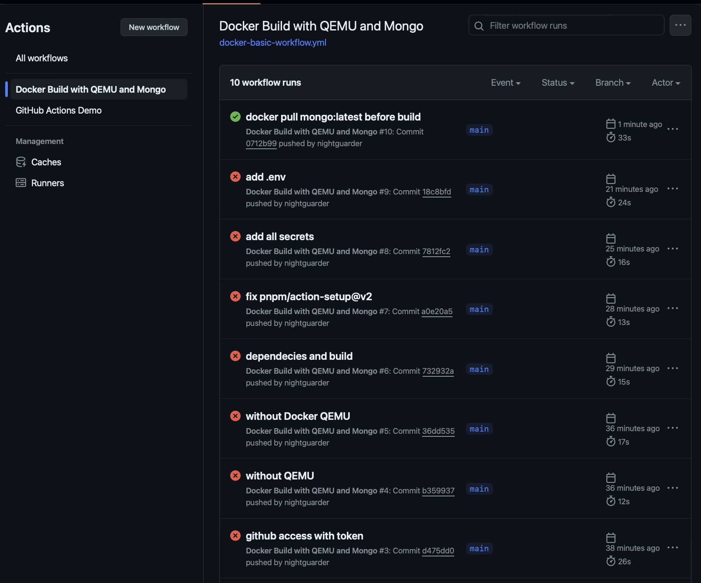

# FullDevLekce12

## Domácí úkol 12

- Deadline: 18.1.2024 23:59
- Počet bodů: 15

**Cílem tohoto úkolu je dockerizovat aplikaci a nastavit CI/CD**

- [x] vytvoř Dockerfile
- [x] nastav GithubAction workflow pro build kontejneru a push do GHCR (Github Container Registry)
- [x] _Extra_ Add Docker QEMU

## Notes

Following this tutorial:

[](https://www.youtube.com/watch?v=aZzV6X7XhyI)

- The Workflow [dockerfile-workflow.yml](.github/workflows/docker-basic-workflow.yml) is doing simple jobs with steps:

1. Checkout code and login to GHCR
2. Install dependencies
3. Docker QEMU
4. Build Docker Image using Dockerfile with passed args
5. Publish MongoDB tag to DockerHub


## **Workflow yaml commands:**

- **name** defines a unique name for the workflow.
- **on** specifies the trigger for the workflow, such as when a push is made to the repository or a pull request is opened.
- **jobs** contains one or more jobs that make up the workflow.
- **steps** specifies a list of steps to run in a job.
- **env** defines environment variables that will be used in the workflow.
- **runs-on** specifies the type of runner to use for a job.



- [Context access might be invalid](https://github.com/github/vscode-github-actions/issues/222)

# Project start

1. In your preferred terminal run:`docker compose up`
2. Back in project run: `npm run server`

## --Save-dev Dependecies

- Run these commands after cloning the repository:

1. ` pnpm install --save-dev @typescript-eslint/parser @typescript-eslint/eslint-plugin eslint typescript prettier ts-node-dev @types/express @types/cors`

2. `npx eslint --init`

- add this to rules

```
//Custom added rules
    "@typescript-eslint/no-unused-vars": "warn",
    // to enforce using type for object type definitions, can be type or interface
    "@typescript-eslint/consistent-type-definitions": ["error", "type"],
    "@typescript-eslint/no-explicit-any": "off"

```
